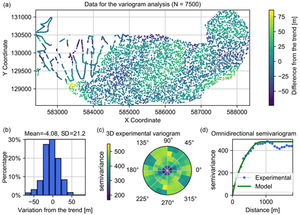
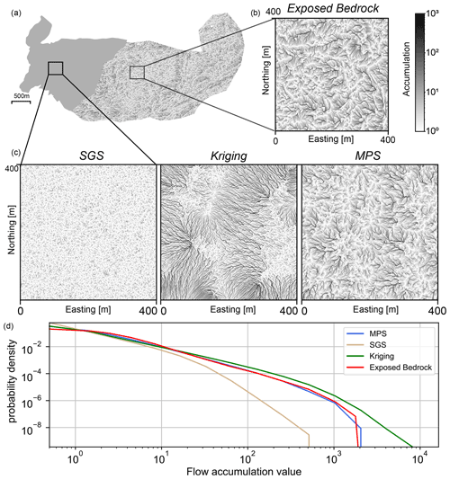

# Glacier Bedrock Interpolation Using Multiple-Point Statistics

**Author**: Alexis Neven and Valentin Dall'Alba  
**Publication**: The Cryosphere, 2021  
**DOI**: https://doi.org/10.5194/tc-15-5169-2021 (https://tc.copernicus.org/articles/15/5169/2021/)  

---

## 🧭 Overview

This repository contains the data processing pipeline and simulation scripts used in the study "Ice volume and basal topography estimation using geostatistical methods and ground-penetrating radar measurements: application to the Tsanfleuron and Scex Rouge glaciers, Swiss Alps" from Neven and Dall'Alba 2021.

The goal is to interpolate glacier **bedrock topography** from **ground-penetrating radar (GPR)** measurements using **multiple-point statistics (MPS)**, with a focus on capturing complex subglacial features and providing robust uncertainty estimates.

---

## 📌 Problem

Ground-penetrating radar (GPR) is widely used to estimate glacier thickness, but measurements are typically acquired only along discrete profiles. This creates challenges when interpolating between profiles, especially in glaciated terrain with **complex basal geomorphology**.

Traditional interpolation methods like **Ordinary kriging** or **Sequential Gaussian simulation (SGS)** often fail to reproduce realistic basal structures and tend to underestimate associated uncertainty.

  

---

## 💡 Solution

We apply the **Direct Sampling (DS)** algorithm from the **Multiple-Point Statistics** framework to interpolate bedrock topography from GPR measurements.  

This approach allows :
- Reproduces **complex geomorphology** (e.g., karstic features)
- Provides a set of **equiprobable realizations** for uncertainty quantification
- Enhances **ice volume estimation accuracy**

We evaluate MPS against kriging and SGS on:
- A **synthetic glacier dataset** with known ground truth
- The **real Tsanfleuron Glacier dataset** (Switzerland)

---

## 🧊 Key Results

Estimated ice volume for the **Scex Rouge** and **Tsanfleuron** glaciers : **113.9 ± 1.6 million m³**
MPS accurately captures basal morphology and uncertainty, improving the quality of subglacial flow and hydrology modeling.

  

---

